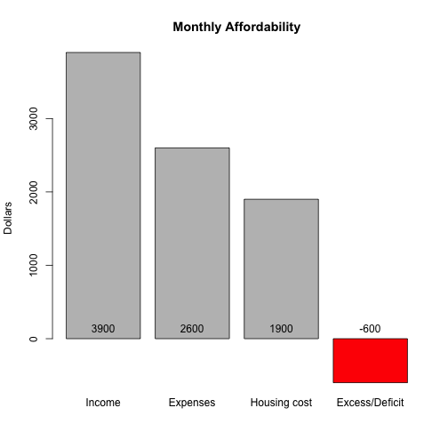
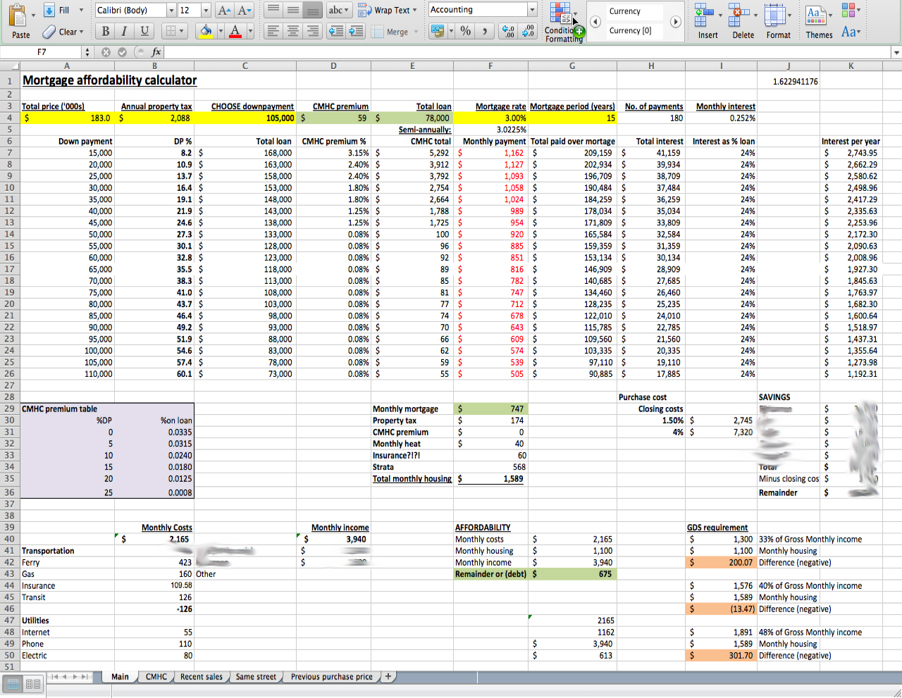

## Introduction

You're thinking it's about time you stop renting and try to invest some of your living expenses into your home, but can you afford it? Three major variables come into play:

1. How much money you earn
2. How much you spend
3. The size of the mortgage, and its terms

--- .class #id 

## Black vs. Red

You can't spend more than you earn each month. You need to stay "in the black," or you'll end up having to borrow to cover your mortgage payments... and could end up being foreclosed on.

 

---
## Why a Shiny App?

You could easily enter your information into Excel...  

 
 
... but it won't play or display nicely on your smartphone when you're out an an open house.

---
## Try it out!

<a href="http://coppinr.shinyapps.io/course_project">http://coppinr.shinyapps.io/course_project</a>
<iframe src="http://coppinr.shinyapps.io/course_project"></iframe>
